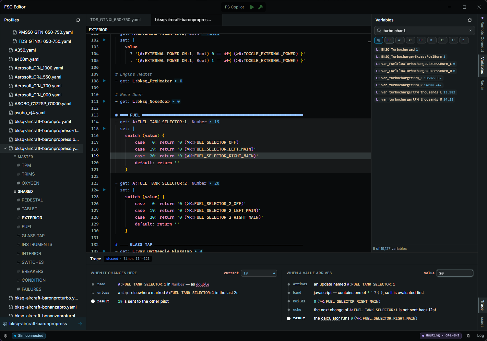

# FSC Editor

> [!WARNING]
> Alpha software. Expect bugs, and expect things to change between versions.

An editor for [FS Copilot](https://github.com/yury-sch/FsCopilot) aircraft profiles, built on the same editor that powers VS Code. It understands the profile format, knows what FS Copilot will do with what you write, and connects to the running sim.



### Variables & discovery

- An index of every variable found in your other profiles, the MSFS SDK docs and the sim, easily searchable (e.g. `battery switch` finds `XMLVAR_BATTERYSTBY_SWITCHSTATE`).
- Radar feature records sim activity and ranks which variables moved after an interaction (not super reliable across different aircraft).
- A picker for `ignore:` and `pointer:` entries that lists the cockpit's panels live and outlines the chosen one in the sim.

### Language support

- Profiles are treated as their own language, not as simple YAML.
- Full syntax highlighting covers everything down to RPN and JavaScript inside `set:` entries.
- Completions, signature help and type hovers for JavaScript inside `set:`, with value typed from the entry's unit.
- `get:` completions drawn from the variable database and other profiles.
- `set:` completions surface what other profiles write for that variable and the shapes a `set:` can take.
- Inside `(>…)`, only writable names are offered, and `K:` events complete with their full calling shape.
- Hovering a variable says what it is, what the SDK or another profile's comment says about it, and how many profiles use it.
- Format on save, to one canonical form that looks good.
- Comment headings (`# ═══ TITLE ═══`) become sections: an outline in the sidebar, and folds in the editor.

### Live sim connection

- Live values appear inline on every `get:` entry, and in most editor features where a variable is displayed.
- A Run button evaluates and fires a setter.
- While connected, the app builds a lasting record per aircraft: which variables exist, their native units, how often they change, and which cockpit controls they move with. Radar's ranking and the aircraft-aware diagnostics draw on it.

### FS Copilot

- Diagnostics for entries that load but don't work as written: a two-parameter event missing its `K:2:`, unbalanced RPN, a write to a variable that can't be set. Each explains the behaviour behind it, and most have a quick fix suggestion.
- Trace walks the entry under the caret through FS Copilot's logic, both sending and receiving, step by step, with test values you type in.
- Start, stop, and restart FS Copilot from the title bar, when the workspace belongs to an FS Copilot install.

### Remote Connect

- Connect to another FSC Editor with a six-character code.
- Share profiles you select and the peer can pull your changes.
- Mirror: once the peer turns it on for a file, your saves are written to their copy as you make them.

## Requirements

- Windows 11. Windows 10 is untested.
- Microsoft Flight Simulator 2024, for the live features. MSFS 2020 will probably work, but it is untested and unsupported.
- The sim module, for `L:` variables. The app installs it into your Community folder. Without it, the connection still reads `A:` variables, input events and the loaded aircraft.
- FS Copilot is optional. The app opens an FS Copilot install, or any folder of profile `.yaml` files, so you can edit a profile someone sent you without installing it.

## Getting it

Download the latest release from [Releases](https://github.com/xiprox/fsc-editor/releases/latest).

- `FSC-Editor-<version>-setup.exe` installs the app and keeps it updated.
- `FSC-Editor-<version>-portable.exe` runs without installing and does not update itself.

The builds are unsigned, so Windows SmartScreen will warn on first run. Choose "More info", then "Run anyway".

## Building it

Node 22.6 or newer. There are no native dependencies, so nothing else is needed for the app itself.

```bash
npm install
```

```bash
npm run dev
```

```bash
npm run build        # typecheck and bundle into out/
npm run build:win    # the installer and the portable build, into dist/
npm test
```

Set `FSCE_WORKSPACE` to a folder of profiles to skip the setup screen.

**The sim module** is committed prebuilt in `link/Packages/`, so building the app never compiles it. Rebuilding it needs the MSFS 2024 SDK, Visual Studio with the MSFS platform toolset, and the sim installed. See [link/README.md](link/README.md) (unedited AI doc).

**The relay** behind Remote Connect is in `relay/`. `npm run relay:dev` runs one locally, and `FSCE_RELAY_URL` points the app at it.

Design docs are in [docs/](docs/): the profile format, Remote Connect's protocol, the UI and copy rules, and the simulator work. All unedited AI output.

## Licence

MIT. See [LICENSE](LICENSE). The profiles in `corpus/` belong to their authors and are not covered by it.
